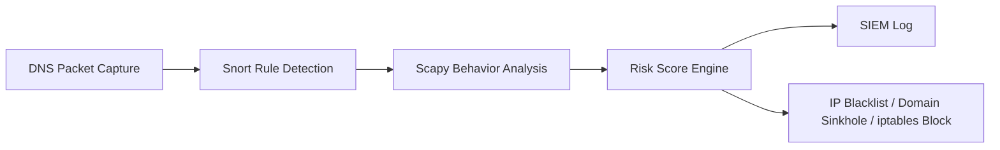

# DNS 터널링 탐지·대응 시스템

**Snort(규칙 기반) · Scapy(행위 기반) · Risk Engine(점수화 기반)** 을 결합해 DNS 터널링을 탐지하고,
SIEM 로깅과 자동 대응(iptables 차단 / DNS sinkhole / IP·도메인 블랙리스트)까지 이어지는
통합 IDS/IPS 파이프라인입니다. VMware 실습망 환경을 기준으로 합니다.

> **방어 목적 전용 프로젝트입니다.** 공격 자동화나 외부 C2 연동 코드는 포함하지 않습니다.
> 자세한 운영 원칙은 [안전 / 운영 원칙](#안전--운영-원칙)을 참고하세요.

## 목차

- [아키텍처](#아키텍처)
- [디렉터리 구조](#디렉터리-구조)
- [빠른 시작](#빠른-시작)
- [CLI 명령어](#cli-명령어)
- [Offline vs Live](#offline-vs-live)
- [설정 (`config/settings.yaml`)](#설정-configsettingsyaml)
- [Live SOAR 엔진](#live-soar-엔진)
- [안전 / 운영 원칙](#안전--운영-원칙)
- [요구 사항](#요구-사항)

## 아키텍처



각 단계는 독립적으로 실행할 수 있고, `scripts/risk_engine.py`가 Scapy 분석 결과·Snort 알림·
IP/도메인 블랙리스트를 모두 취합해 최종 위험도(점수·verdict)를 산출합니다.

## 디렉터리 구조

```text
.
├── run.py                          # 통합 CLI 진입점
├── engine/
│   ├── live_soar_engine.py         # 실시간 DNS 수집·분석·자동 대응 엔진
│   └── README.md                   # live 엔진 상세 문서
├── scripts/
│   ├── dns_analyzer.py             # pcap 오프라인 분석 (feature 추출)
│   ├── risk_engine.py              # 위험도 점수화 / verdict 판정
│   ├── plot_results.py             # 탐지 결과 시각화
│   ├── generate_sample_pcap.py     # 테스트용 샘플 pcap 생성
│   ├── block_ip.sh / unblock_ip.sh # iptables 차단 / 해제
│   ├── block_domain.sh             # dnsmasq sinkhole 적용
│   └── run_live_engine.sh / run_snort.sh / capture_dns.sh
├── rules/                          # Snort 규칙, IP/도메인 블랙·화이트리스트
├── config/settings.yaml            # 임계치 · 점수 · 대응 설정
├── pcaps/                          # 분석 대상 pcap (git에는 미포함)
└── results/                        # 분석 결과 CSV/JSON/그래프/로그 (대부분 git에는 미포함)
```

## 빠른 시작

```bash
pip install -r requirements.txt

python run.py sample                              # 테스트용 샘플 pcap 생성
python run.py analyze <pcap>                       # Scapy 분석 → CSV/JSON
python run.py detect <pcap>                         # 위험도 점수 + verdict 산출
python run.py compare <normal_pcap> <attack_pcap>   # 정상 vs 공격 비교
python run.py plot <pcap>                           # 결과 그래프 생성

sudo bash scripts/run_live_engine.sh                # 실시간 SOAR 엔진 실행
```

## CLI 명령어

| 명령어 | 설명 | 비고 |
|---|---|---|
| `run.py analyze <pcap...> [--compare]` | Scapy 기반 DNS 분석 → CSV/JSON 저장 | 여러 pcap 동시 지정 가능 |
| `run.py detect <pcap> [--block] [--live]` | 위험도 점수·verdict 산출 및 로그 기록 | `--block`: HIGH/CRITICAL 시 차단 스크립트 실행(기본 dry-run) · `--live`: dry-run 없이 실제 차단 수행 |
| `run.py compare <normal_pcap> <attack_pcap>` | 정상 vs 공격 트래픽 비교 리포트 | `results/compare_summary.csv` 생성 |
| `run.py plot <pcap...>` | qname 길이 / entropy / qtype 분포 그래프 생성 | `results/graphs/` 에 저장 |
| `run.py sample` | 정상/공격 유사 샘플 pcap 생성 | 실습용, 실제 dnscat2 트래픽 아님 |
| `run.py live` | 실시간 SOAR 엔진 실행 | `scripts/run_live_engine.sh` 와 동일 |

> `detect --live`의 "live"는 [Live SOAR 엔진](#live-soar-엔진)의 실시간 캡처와는 무관하며,
> **오프라인 분석 결과를 실제로 차단할지(dry-run 해제)** 를 의미합니다. 혼동하지 않도록 주의하세요.

## Offline vs Live

| 구분 | 대상 | 커맨드 |
|---|---|---|
| **Offline 분석** | 저장된 pcap을 재현 가능하게 분석·시각화 | `run.py analyze / detect / compare / plot` |
| **Live 분석** | 실시간 DNS 스트림 감시 + SIEM NDJSON/차단 연동 | `scripts/run_live_engine.sh` 또는 `run.py live` |

## 설정 (`config/settings.yaml`)

탐지 임계치, 항목별 위험 점수, verdict 등급 경계, 블랙/화이트리스트 경로, 차단 정책을
한 곳에서 관리합니다. `schema.require_keys`에 명시된 최상위 키가 없으면 로딩 시 즉시 에러를 냅니다.

| 섹션 | 역할 |
|---|---|
| `thresholds` | 각 탐지 지표(entropy, qname 길이, qps 등)의 임계값 |
| `risk_scores` | 임계값 초과 시 부여되는 점수 (도메인/IP 블랙리스트 히트 포함) |
| `risk_levels` | 총점 기준 verdict 등급 경계 (NORMAL/SUSPICIOUS/MALICIOUS/CRITICAL) |
| `blacklist` | 의심 도메인, IP/도메인/화이트리스트 파일 경로 |
| `response` | 차단 모드(`kali_input` / `ubuntu_output` / `gateway_forward`), TTL |
| `live` | 실시간 엔진의 인터페이스, BPF 필터, NDJSON/상태 DB 경로 |

## Live SOAR 엔진

- `sniff(iface="any", filter="udp port 53", store=0)` 기반 실시간 수집
- 큐 파이프라인 + oldest-drop 정책으로 백프레셔 처리
- 위험도 CRITICAL 시 차단 연동(`block_ip.sh`), TTL 만료 시 자동 해제(`unblock_ip.sh`)
- 차단 상태는 `results/live_soar_state.db`(SQLite)에 **벽시계(epoch) 기준**으로 저장되어
  엔진이 재시작되어도 TTL 스케줄이 올바르게 유지됩니다
- SIEM NDJSON 저장: `results/siem_dns_detect.json`

자세한 내용은 [`engine/README.md`](engine/README.md)를 참고하세요.

## 안전 / 운영 원칙

- 본 저장소는 **방어(탐지/대응) 목적** 전용입니다.
- dnscat2 실행 자동화 및 공격 자동화 코드는 포함하지 않습니다.
- 차단 스크립트(`block_ip.sh`, `block_domain.sh` 등)는 반드시 격리된 실습망에서만 사용하세요.
- `engine/live_soar_engine.py`의 패킷 처리 경로(`process_packet`)는 DB 접근·정규식·subprocess 호출을
  하지 않도록 제한되어 있습니다 (자세한 제약은 [`AGENTS.md`](AGENTS.md) 참고).

## 요구 사항

```bash
pip install -r requirements.txt        # 오프라인 분석 (scapy, pyyaml, matplotlib)
pip install -r requirements-live.txt   # 실시간 엔진 (scapy, pyyaml, regex)
```

실시간 엔진 실행 및 iptables 차단은 Linux 환경과 관리자 권한(sudo)이 필요합니다.
