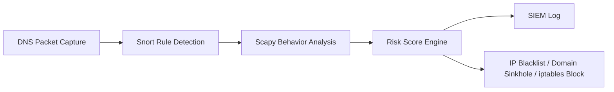

# DNS 터널링 탐지·대응 시스템

**Snort(규칙 기반) · Scapy(행위 기반) · Risk Engine(점수화 기반)** 을 결합해 DNS 터널링을 탐지하고,
SIEM 로깅과 자동 대응(iptables 차단 / DNS sinkhole / IP·도메인 블랙리스트)까지 이어지는
통합 IDS/IPS 파이프라인입니다. VMware/VirtualBox 기반 실습망 환경을 기준으로 합니다.

> **방어(탐지/대응) 목적 전용 프로젝트입니다.** 공격 자동화 도구 실행이나 외부 C2 접속 코드는
> 포함하지 않습니다. pcap 분석, DNS query feature 추출, 탐지 규칙 검증, SIEM 로그 생성,
> blacklist/sinkhole/iptables 기반 방어 대응 실험이 목적입니다. 자세한 내용은
> [안전 / 운영 원칙](#20-안전--운영-원칙)을 참고하세요.

## 목차

1. [아키텍처](#1-아키텍처)
2. [디렉터리 구조](#2-디렉터리-구조)
3. [설치](#3-설치)
4. [빠른 시작](#4-빠른-시작)
5. [CLI 명령어](#5-cli-명령어)
6. [Offline vs Live](#6-offline-vs-live)
7. [설정 (`config/settings.yaml`)](#7-설정-configsettingsyaml)
8. [Offline 분석 흐름](#8-offline-분석-흐름)
9. [Shannon Entropy 탐지 기준](#9-shannon-entropy-탐지-기준)
10. [Risk Engine](#10-risk-engine)
11. [Snort Rule Detection](#11-snort-rule-detection)
12. [Live SOAR Engine](#12-live-soar-engine)
13. [Blacklist / Whitelist 정책](#13-blacklist--whitelist-정책)
14. [Defense Scripts](#14-defense-scripts)
15. [dnsmasq sinkhole](#15-dnsmasq-sinkhole)
16. [pcap 수집](#16-pcap-수집)
17. [그래프 생성](#17-그래프-생성)
18. [결과 파일 정리](#18-결과-파일-정리)
19. [검증 명령](#19-검증-명령)
20. [안전 / 운영 원칙](#20-안전--운영-원칙)

## 1. 아키텍처



| 계층 | 주요 파일 | 역할 |
|---|---|---|
| Packet Capture | `scripts/capture_dns.sh`, `pcaps/` | UDP/53 DNS 트래픽을 pcap으로 저장 |
| Snort Rule Detection | `rules/dns_tunnel.rules`, `scripts/run_snort.sh` | attacker.lab, 긴 DNS payload, Base32/HEX-like label, random subdomain heuristic 탐지 |
| Offline Scapy Analyzer | `scripts/dns_analyzer.py` | pcap에서 DNS Query/Response feature 추출, NXDOMAIN 분석, Shannon entropy 계산 |
| Risk Engine | `scripts/risk_engine.py` | analyzer 결과, Snort alert, 도메인/IP 블랙리스트 hit를 결합해 risk score/verdict 생성 |
| Live SOAR Engine | `engine/live_soar_engine.py` | 실시간 DNS query sniff, queue 기반 분석, CRITICAL 차단, TTL 자동 해제, SIEM NDJSON 출력 |
| Defense Scripts | `scripts/block_ip.sh`, `scripts/unblock_ip.sh`, `scripts/block_domain.sh` | iptables 차단/해제, dnsmasq sinkhole 설정 생성 |
| Policy Files | `rules/ip_blacklist.txt`, `rules/domain_blacklist.txt`, `rules/domain_whitelist.txt` | IP/domain 차단 및 예외 정책 |
| Configuration | `config/settings.yaml` | 임계값, 점수, blacklist 경로, live engine 출력 경로 설정 |

## 2. 디렉터리 구조

```text
DNS-attack-detection-and-defense/
├── README.md
├── AGENTS.md
├── requirements.txt
├── requirements-live.txt
├── run.py
├── config/
│   └── settings.yaml
├── engine/
│   ├── README.md
│   └── live_soar_engine.py
├── pcaps/
├── results/
│   └── graphs/
├── rules/
│   ├── dns_tunnel.rules
│   ├── dnsmasq_sinkhole.conf
│   ├── ip_blacklist.txt
│   ├── domain_blacklist.txt
│   └── domain_whitelist.txt
└── scripts/
    ├── capture_dns.sh
    ├── dns_analyzer.py
    ├── risk_engine.py
    ├── plot_results.py
    ├── generate_sample_pcap.py
    ├── run_snort.sh
    ├── run_live_engine.sh
    ├── block_ip.sh
    ├── unblock_ip.sh
    └── block_domain.sh
```

## 3. 설치

### 3.1 시스템 패키지

IDS Ubuntu에서 기본 도구를 설치합니다.

```bash
sudo apt update
sudo apt install -y git python3 python3-pip python3-venv tcpdump dnsutils iproute2 iptables dnsmasq snort tshark
```

Wireshark GUI가 필요하면 추가로 설치할 수 있습니다.

```bash
sudo apt install -y wireshark
```

### 3.2 Python 가상환경

로컬 IDE와 VM 모두 가상환경 사용을 권장합니다.

```bash
python3 -m venv .venv
source .venv/bin/activate
pip install --upgrade pip
pip install -r requirements.txt
pip install -r requirements-live.txt
```

`requirements.txt`는 offline 분석/그래프용 의존성(scapy, pyyaml, matplotlib)을 포함하고,
`requirements-live.txt`는 live engine 실행에 필요한 최소 의존성(scapy, pyyaml, regex)을 포함합니다.
live engine은 `config/settings.yaml`을 읽기 위해 `pyyaml`도 사용합니다.

## 4. 빠른 시작

레포 루트에서 실행합니다.

```bash
python run.py sample
python run.py analyze pcaps/normal_dns.pcap
python run.py detect pcaps/dnscat2_connect.pcap
python run.py compare pcaps/normal_dns.pcap pcaps/dnscat2_connect.pcap
python run.py plot pcaps/normal_dns.pcap pcaps/dnscat2_connect.pcap

sudo bash scripts/run_live_engine.sh   # 실시간 SOAR 엔진 실행
```

## 5. CLI 명령어

| 명령어 | 설명 | 비고 |
|---|---|---|
| `run.py analyze <pcap...> [--compare]` | Scapy 기반 DNS 분석 → CSV/JSON 저장 | `--compare` 없이 여러 pcap을 주면 각각 개별 분석·저장, `--compare`면 하나의 비교 리포트로 합침 |
| `run.py detect <pcap> [--block] [--live]` | 위험도 점수·verdict 산출 및 로그 기록 | `--block`: HIGH/CRITICAL 시 차단 스크립트 실행(기본 dry-run) · `--live`: dry-run 없이 실제 차단 수행 |
| `run.py compare <normal_pcap> <attack_pcap>` | 정상 vs 공격 트래픽 비교 리포트 | `results/compare_summary.csv` 생성 |
| `run.py plot <pcap...>` | qname 길이 / entropy / qtype 분포 그래프 생성 | `results/graphs/` 에 저장 |
| `run.py plot --csv <detection_result.csv>` | risk score 막대그래프 생성 | `results/graphs/risk_scores.png` 저장 |
| `run.py sample` | 정상/공격 유사 샘플 pcap 생성 | 실습용, 실제 dnscat2 트래픽 아님 |
| `run.py live` | 실시간 SOAR 엔진 실행 | `scripts/run_live_engine.sh` 와 동일 |

> `detect --live`의 "live"는 [Live SOAR Engine](#12-live-soar-engine)의 실시간 캡처와는 무관하며,
> **오프라인 분석 결과를 실제로 차단할지(dry-run 해제)** 를 의미합니다. 혼동하지 않도록 주의하세요.

## 6. Offline vs Live

| 구분 | 대상 | 커맨드 |
|---|---|---|
| **Offline 분석** | 저장된 pcap을 재현 가능하게 분석·시각화 | `run.py analyze / detect / compare / plot` |
| **Live 분석** | 실시간 DNS 스트림 감시 + SIEM NDJSON/차단 연동 | `scripts/run_live_engine.sh` 또는 `run.py live` |

## 7. 설정 (`config/settings.yaml`)

탐지 임계치, 항목별 위험 점수, verdict 등급 경계, 블랙/화이트리스트 경로, 차단 정책을
한 곳에서 관리합니다. `schema.require_keys`에 명시된 최상위 키가 없으면 로딩 시 즉시 에러를 냅니다.

| 섹션 | 역할 |
|---|---|
| `thresholds` | 각 탐지 지표(entropy, qname 길이, qps 등)의 임계값 |
| `risk_scores` | 임계값 초과 시 부여되는 점수 (도메인/IP 블랙리스트 히트 포함) |
| `risk_levels` | 총점 기준 verdict 등급 경계 (NORMAL/SUSPICIOUS/MALICIOUS/CRITICAL) |
| `blacklist` | 의심 도메인, IP/도메인/화이트리스트 파일 경로 |
| `response` | 차단 모드(`kali_input` / `ubuntu_output` / `gateway_forward`), TTL |
| `live` | 실시간 엔진의 인터페이스, BPF 필터, NDJSON/상태 DB 경로 |

## 8. Offline 분석 흐름

Offline 분석은 저장된 pcap 파일을 대상으로 수행합니다.

```text
pcap
→ scripts/dns_analyzer.py
→ DNSPacketRecord 추출
→ HostStats 집계
→ scripts/risk_engine.py
→ detection_result.csv/json, alert.log
```

### 8.1 DNS Analyzer feature

`scripts/dns_analyzer.py`는 다음 정보를 추출합니다.

- `timestamp`, `src_ip`, `dst_ip`
- DNS Query/Response 여부
- `qname`, `qtype`, `qname_length`
- `subdomain`, `subdomain_length`, `base_domain`
- Shannon entropy
- DNS response `rcode`
- NXDOMAIN 여부
- suspicious qtype 여부
- label count
- digit ratio, alpha ratio, unique char ratio
- Base32-like label 여부
- HEX-like label 여부

NXDOMAIN은 DNS Response의 `rcode == 3`을 기준으로 계산합니다. 따라서 NXDOMAIN 분석은 response packet이 포함된 offline pcap에서 가장 정확합니다.

### 8.2 HostStats 주요 항목

`dns_analyzer.py`는 src_ip 기준으로 다음 통계를 생성합니다.

- `query_count`, `response_count`
- `nxdomain_count`, `nxdomain_ratio`
- `queries_per_second`, `queries_per_minute`
- `avg_qname_length`, `max_qname_length`
- `avg_subdomain_length`
- `avg_entropy`, `max_entropy`
- `txt_cname_mx_ratio`, `suspicious_qtype_ratio`
- `unique_subdomain_ratio`
- `repeated_base_domain_max`
- `attacker_domain_hits`
- `base32_like_count`, `hex_like_count`
- `qtype_distribution`
- 실제 sliding window 기반 `max_query_count_10s`

## 9. Shannon Entropy 탐지 기준

DNS 터널링은 subdomain에 인코딩된 데이터가 들어가면서 문자열 무작위성이 증가할 수 있습니다. 이 프로젝트는 qname에서 subdomain을 분리하고, subdomain이 있으면 subdomain 기준으로 Shannon entropy를 계산합니다. subdomain이 없으면 전체 qname을 기준으로 계산합니다.

Risk Engine은 다음 값을 사용합니다.

- `avg_entropy`
- `max_entropy`

기본 임계값은 `config/settings.yaml`에서 관리합니다.

```yaml
thresholds:
  avg_entropy: 3.5
  max_entropy: 4.5
```

Live SOAR Engine은 실시간 query의 entropy가 `max_entropy` 임계값을 초과하면 위험 점수에 반영합니다.

## 10. Risk Engine

`scripts/risk_engine.py`는 analyzer 결과와 Snort alert, 도메인 blacklist hit, **IP blacklist hit**(`rules/ip_blacklist.txt`)를 결합해 최종 위험도를 계산합니다.

주요 점수 항목은 다음과 같습니다.

- 평균/최대 qname length
- 평균/최대 entropy
- queries per minute
- 10초 window 최대 query count
- TXT/CNAME/MX ratio
- NXDOMAIN ratio
- repeated base domain count
- Base32-like count
- HEX-like count
- Snort alert count
- attacker domain hit
- 도메인 blacklist hit
- IP blacklist hit

결과는 다음 파일로 저장됩니다.

```text
results/detection_result.csv
results/detection_result.json
results/alert.log
```

도메인/IP blacklist hit는 단독으로 높은 점수를 부여받을 수 있으므로, 정책 파일(`rules/domain_blacklist.txt`, `rules/ip_blacklist.txt`)에 등록된 값과 매칭되면 HIGH/CRITICAL 판단에 큰 영향을 줍니다.

## 11. Snort Rule Detection

Snort 룰은 `rules/dns_tunnel.rules`에 있습니다.

현재 룰의 목적은 1차 탐지입니다.

- `attacker.lab` 도메인 문자열 탐지
- 긴 DNS payload 탐지
- Base32-like label pattern 탐지
- HEX-like label pattern 탐지
- random long subdomain pattern 탐지
- TXT/CNAME/MX heuristic payload 탐지

정확한 qname 길이, Shannon entropy, 10초 window 빈도, NXDOMAIN 비율은 Snort가 아니라 Scapy/Python 분석기에서 계산합니다.

Snort 실행 예시:

```bash
sudo bash scripts/run_snort.sh pcaps/dnscat2_connect.pcap /etc/snort/snort.conf
```

`run_snort.sh`는 pcap 경로와 Snort 설정 파일 경로를 인자로 받으며, 결과는 `results/`에 저장됩니다.

## 12. Live SOAR Engine

Live engine은 실시간 DNS query를 감시하고, 위험도가 CRITICAL이면 `block_ip.sh`와 연동해 차단합니다.

```bash
sudo bash scripts/run_live_engine.sh
```

또는 가상환경 패키지를 확실히 사용하려면 다음처럼 실행합니다.

```bash
sudo .venv/bin/python engine/live_soar_engine.py
```

`run_live_engine.sh`는 현재 `python3 engine/live_soar_engine.py`를 호출합니다. 따라서 VM에서 `.venv`에만 scapy/pyyaml이 설치되어 있다면 위의 `.venv/bin/python` 방식이 더 안전합니다.

### 12.1 Live engine 설정

`config/settings.yaml`의 live 설정을 사용합니다.

```yaml
live:
  enabled: true
  iface: any
  bpf_filter: "udp port 53"
  ndjson_output: results/siem_dns_detect.json
  state_db: results/live_soar_state.db
```

Scapy 환경에 따라 `iface: any`가 동작하지 않을 수 있습니다. 이 경우 `ip -br addr` 또는 Scapy의 `get_if_list()`로 실제 인터페이스명을 확인한 뒤 `enp0s3`, `enp0s8`, `ens33` 같은 이름으로 바꿔야 합니다.

인터페이스 확인:

```bash
ip -br addr
sudo .venv/bin/python - << 'PY'
from scapy.all import get_if_list
print(get_if_list())
PY
```

### 12.2 Live engine 출력

Live engine은 다음 파일을 생성합니다.

```text
results/siem_dns_detect.json
results/live_soar_state.db
results/live_soar_state.db-wal
results/live_soar_state.db-shm
results/block_rules.log
```

`results/siem_dns_detect.json`은 NDJSON 형식입니다. 한 줄이 하나의 탐지 이벤트입니다.

### 12.3 Live engine 주요 로직

- Scapy `sniff()`로 UDP/53 DNS query 수집
- `process_packet()`에서는 qname/src_ip/dst_ip/qtype 등 최소 정보만 추출 (DB 접근·정규식·subprocess 호출 없음)
- queue 기반 비동기 분석
- entropy, 10초 window query count, interval stddev, blacklist hit 기반 risk score 계산
- CRITICAL 이벤트는 block worker로 전달
- SQLite WAL 상태 DB에 차단 상태 저장
- TTL 만료 시 `unblock_ip.sh` 호출

### 12.4 상태 저장 방식

차단 상태와 TTL 만료 시각은 SQLite(`results/live_soar_state.db`)에 **벽시계(epoch, `time.time()`) 기준**으로
저장됩니다. `time.monotonic()`은 프로세스/부팅마다 기준점이 달라지므로, 엔진이 재시작되어도 유효해야 하는
영속 데이터에는 사용하지 않습니다. 구버전 스키마(`unblock_at_mono`)로 만들어진 DB는 기동 시 자동으로
감지되어 정리(재생성)됩니다.

## 13. Blacklist / Whitelist 정책

정책 파일은 `rules/` 아래에 있습니다.

### 13.1 IP blacklist

`rules/ip_blacklist.txt`

```text
# One IPv4 per line
172.30.1.250
172.30.1.251
```

Live engine과 Risk Engine(offline) 모두 line 단위 문자열 set으로 IP blacklist를 읽습니다. IP를 한 줄에 하나씩 적어야 합니다.

### 13.2 Domain blacklist

`rules/domain_blacklist.txt`

```text
# One domain per line
attacker.lab
evil.lab
malicious.local
```

Risk Engine과 Live Engine은 domain blacklist를 읽어 base domain과 비교합니다.

### 13.3 Domain whitelist

`rules/domain_whitelist.txt`

```text
# One domain per line
google.com
github.com
microsoft.com
```

whitelist domain은 live engine에서 INFO 이벤트로 처리되어 일반 위험 점수 계산에서 제외됩니다.

## 14. Defense Scripts

### 14.1 IP block

```bash
sudo bash scripts/block_ip.sh <src_ip> <mode>
```

지원 mode:

```text
kali_input
ubuntu_output
gateway_forward
```

예시:

```bash
sudo bash scripts/block_ip.sh 172.30.1.44 kali_input
```

`block_ip.sh`는 IPv4 형식을 검사하고, `iptables -C`로 중복 rule을 확인한 뒤 없을 때만 `iptables -A`로 추가합니다.

### 14.2 IP unblock

```bash
sudo bash scripts/unblock_ip.sh <src_ip> <mode>
```

예시:

```bash
sudo bash scripts/unblock_ip.sh 172.30.1.44 kali_input
```

### 14.3 Domain sinkhole

```bash
sudo bash scripts/block_domain.sh attacker.lab
sudo bash scripts/block_domain.sh --apply
```

- 특정 도메인을 인자로 주면 해당 도메인 하나를 `/etc/dnsmasq.d/tunnel_block.conf`에 sinkhole로 기록합니다.
- `--apply`를 사용하면 `rules/domain_blacklist.txt` 전체를 batch로 읽어 sinkhole 설정을 생성합니다.
- 스크립트는 dnsmasq restart 명령을 안내하지만, 자동 restart는 하지 않습니다.

적용 후 필요하면 직접 실행합니다.

```bash
sudo systemctl restart dnsmasq
```

## 15. dnsmasq sinkhole

기본 템플릿은 `rules/dnsmasq_sinkhole.conf`입니다.

```text
address=/attacker.lab/0.0.0.0
address=/evil.lab/0.0.0.0
```

IDS Ubuntu에서 `systemd-resolved`가 `127.0.0.53:53`을 사용 중이면 dnsmasq와 53번 포트 충돌이 날 수 있습니다.

확인:

```bash
sudo ss -luntp | grep :53
```

권장 방식은 systemd-resolved를 바로 끄기보다, dnsmasq를 IDS Ubuntu의 Host-only IP에만 바인딩하는 것입니다.

예시:

```conf
interface=enp0s8
listen-address=192.168.56.20
bind-interfaces

address=/attacker.lab/0.0.0.0
address=/tunnel.lab/0.0.0.0
address=/dnscat.lab/0.0.0.0
```

## 16. pcap 수집

DNS 트래픽 수집은 `scripts/capture_dns.sh`를 사용합니다.

```bash
sudo bash scripts/capture_dns.sh <iface> <name>
```

예시:

```bash
sudo bash scripts/capture_dns.sh enp0s8 normal_dns
sudo bash scripts/capture_dns.sh enp0s8 attack_dns
```

생성 파일은 `pcaps/<name>_<timestamp>.pcap` 형식으로 저장됩니다.

## 17. 그래프 생성

pcap 비교 그래프:

```bash
python run.py plot pcaps/normal_dns.pcap pcaps/dnscat2_connect.pcap
```

risk score 그래프:

```bash
python run.py plot --csv results/detection_result.csv
# 또는 스크립트를 직접 호출해도 동일하게 동작합니다.
python scripts/plot_results.py --csv results/detection_result.csv
```

그래프는 `results/graphs/`에 저장됩니다.

## 18. 결과 파일 정리

입력 pcap은 실험 재현성을 위해 남겨도 됩니다.

```text
pcaps/normal_dns.pcap
pcaps/dnscat2_connect.pcap
```

다만 results 산출물은 실험이 섞이지 않도록 필요 시 백업 후 정리합니다.

```bash
rm -f results/*.csv
rm -f results/*.json
rm -f results/*.log
rm -f results/*.db
rm -f results/*.db-wal
rm -f results/*.db-shm
rm -f results/graphs/*.png
```

GitHub에는 실제 실험 pcap, 운영 로그, DB 파일을 올리지 않는 것을 권장합니다(`.gitignore`에 이미 반영되어 있습니다).

## 19. 검증 명령

문법 검사:

```bash
python -m py_compile run.py scripts/dns_analyzer.py scripts/risk_engine.py engine/live_soar_engine.py
bash -n scripts/block_ip.sh
bash -n scripts/unblock_ip.sh
bash -n scripts/block_domain.sh
bash -n scripts/run_live_engine.sh
bash -n scripts/run_snort.sh
```

Scapy sniff 테스트:

```bash
sudo .venv/bin/python - << 'PY'
from scapy.all import sniff
pkts = sniff(iface="enp0s8", filter="udp port 53", timeout=5, store=1)
print("captured:", len(pkts))
PY
```

인터페이스명은 환경에 맞게 변경합니다.

## 20. 안전 / 운영 원칙

- 본 저장소는 **방어(탐지/대응) 목적** 전용입니다.
- dnscat2 실행 자동화, exploit, 외부 C2 접속 코드는 포함하지 않습니다.
- 차단 스크립트(`block_ip.sh`, `block_domain.sh` 등)는 반드시 격리된 실습망에서만 사용하세요.
- Live sniff와 iptables 차단은 sudo 권한이 필요할 수 있습니다.
- `iptables -F`는 기존 방화벽 규칙을 모두 지울 수 있으므로 실습 VM에서만 신중하게 사용합니다.
- `ubuntu_output` 모드는 DNS 통신 전체에 영향을 줄 수 있으므로 테스트 전에 rule 내용을 확인합니다.
- `engine/live_soar_engine.py`의 패킷 처리 경로(`process_packet`)는 DB 접근·정규식·subprocess 호출을 하지 않도록 제한되어 있습니다. 자세한 제약은 [`AGENTS.md`](AGENTS.md)를 참고하세요.
- Live engine은 query 중심 분석이므로 NXDOMAIN은 offline pcap 분석에서 확인하는 것이 더 정확합니다.
- Snort 룰은 1차 탐지용이고, 정밀 판단은 Scapy/Risk Engine에서 수행합니다.
- `iface: any`가 Scapy에서 동작하지 않으면 실제 인터페이스명으로 변경해야 합니다.
- dnsmasq sinkhole 적용 후에는 `sudo systemctl restart dnsmasq`가 필요할 수 있습니다.
